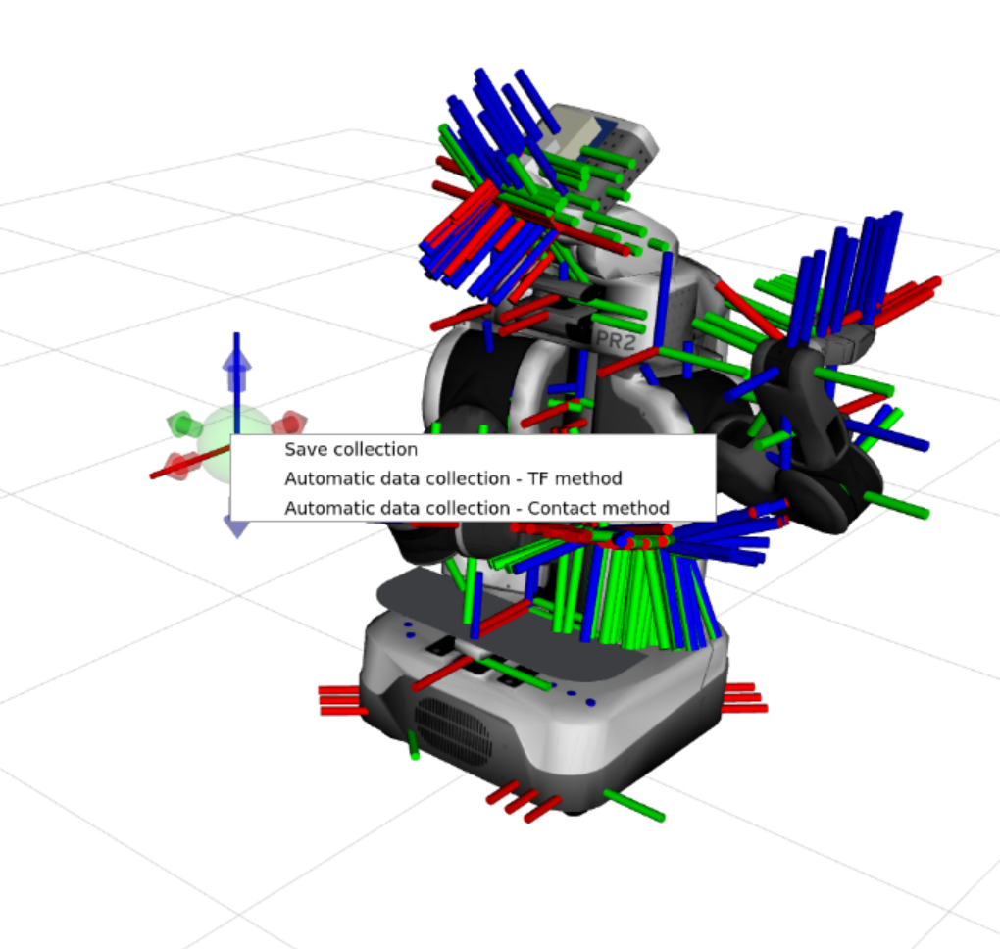

# TAMS PR2 Atom Calibration

This package provides tools for calibrating the PR2 robot using the developed tactile calibration in ATOM.
The user should follow generally the instructions on the official [ATOM documentation](https://lardemua.github.io/atom_documentation/), except for the following cases:

## Record a Bagfile

To record a bagfile, use the `rosbag` command-line tool. This tool allows you to record data from one or more ROS topics for later playback.

```sh
rosbag record -O my_bagfile.bag /topic1 /topic2 ...
```

Replace `/topic1 /topic2 ...` with the names of the topics you want to record.

One thing one must pay attention is to, alongside the normal robot bringups, the user should also bring up the contact detectors. This can be done by running the following command:

```sh
rosrun tams_pr2_atom_calibration contact_message_publisher --hand hand
```

Replace `hand` with the hand you want to use (left or right).
This is only available for the PR2 gripper and the BioTac sensors.
If the user wants to visualize contacts, it should run:

```sh
rosrun tams_pr2_atom_calibration contact_viz_message_publisher --hand hand
```
Replace `hand` with the hand you want to use (left or right).

## Define a config.yml

The config.yml file is used to specify the sensors used in the calibration process, as well as the transformations and/or joint parameters to be estimated. 
These files are in the `calibration` directory.

There are two types of sensors you can define: "regular" sensors and contact sensors.

- Regular Sensors: These are the standard sensors on the robot, such as cameras and LiDARs.
To define a sensor in the config, one must specify various factors.
One is the `topic_name` associated to it, in which messages of this sensor are received.
Other is the `link`, which is the `frame_id` defined in the sensor message.
One must also define the sensor's `modality` [rgb, depth, lidar3d] and if they want to `throttle` its messages (Hz).
Each sensor has a transformation associated to it that will be calibrated.
This transformation is defined as the one between `parent_link` and `child_link`.

- Contact Sensors: These sensors detect when the robot makes contact with an object. They should be defined by specifying the `contact_topic` associated with the sensor, the `touched_link` (the link that is touched by the sensor, can be `closest` if undefined), the `touching_link` (the link that touches the object, defined in the message received in `contact_topic`), and the `touching_visual_link` (if `touching_link` does not have a visual mesh, which happens in the BioTac tips). 

Here's an example of what a config.yml file might look like:

```yaml
sensors:
    azure_rgb_camera:
        link: "azure_kinect_rgb_camera_link"
        parent_link: "azure_kinect_camera_base"
        child_link: "azure_kinect_rgb_sensor"
        topic_name: "/azure_kinect/rgb/image_raw"
        modality: "rgb"
        throttle:

contact_sensors:
    right_hand_sensor:
        contact_topic: "/atom/right_contact"
        touched_link: "closest"
        touching_link: "rh_ff_biotac_link"
        touching_visual_link: "rh_ffdistal"
```

## Launch Automatic Data Collection

While launching the collection of data, the user can automatically record collections through contact detection. 
To do so, one must right-click the floating interactive marker and select the option "Automatic data collection - Contact method":



